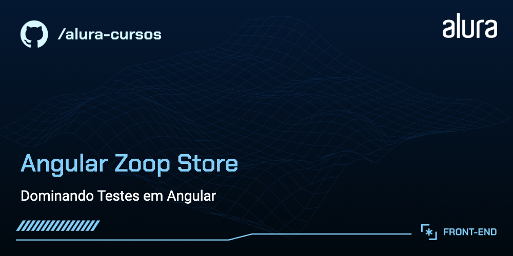

# Zoop Store

Zoop Store é um e-commerce recheiado de produtos de diversas verdentes.

## 🔨 Funcionalidades do projeto

O App oferece uma prática lista de produtos, apresentando detalhes como título, valor, descrição e imagem para uma visualização completa. Além disso, proporciona a conveniência de gerenciar esses produtos, permitindo operações como cadastro, remoção e atualização. Vale ressaltar que as informações do aplicativo são armazenadas localmente no navegador, o que significa que serão perdidas ao fechar o aplicativo.

O [Figma dessa aplicação você encontra aqui](https://www.figma.com/file/ghzMuGeV2n1ninpw2HaMCg/Dominando-Testes-em-Angular?type=design&node-id=9-457&mode=design&t=TuxafGqTTi1CWk5i-0).

## ✔️ Técnicas e tecnologias utilizadas

Se liga nessa lista de tudo que usaremos nesse curso:

- `Angular`
- `Angular CLI`
- `Angular Material`
- `Figma`

## 🛠️ Abrir e rodar o projeto

Para abrir e rodar o projeto, execute `npm i` para instalar as dependências e `ng serve` para iniciar o projeto.

Depois, acesse <a href="http://localhost:4200/">http://localhost:4200/</a> no seu navegador.
